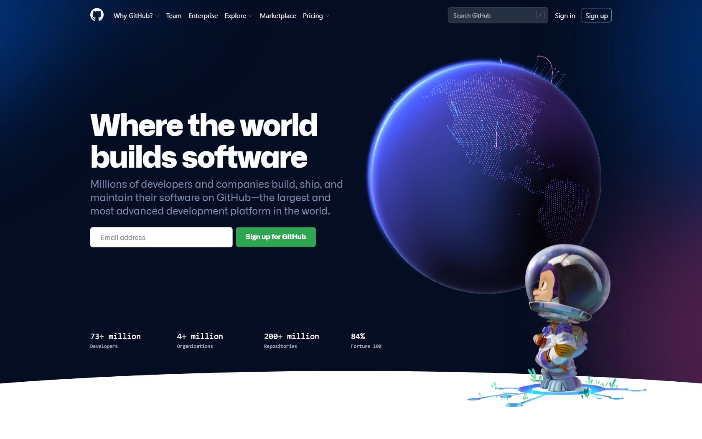

# API Doc

This API scrapes a given website for images and metadata.

It does the following things in order:

1. opens the website in a headless Chromium browser
2. wait up to 5 seconds for an `` tag to load
3. attempts to find all `` tags in the page and extract the `src` attribute
4. ignore non-url `src` attributes such as base64 encoded images for data usage reasons, 
5. try to resolve relative image paths, so "/img.png" will be resolved to "https://domain.tld/img.png"
6. screenshots the page
7. pulls any metadata the page has
8. combines what was found and sends them back

## Limitations

* only `` tags will be considered
    * other images, such as css backgrounds, will be ignored
    * `` tags with 'src' that is not an image url will be ignored
* only considers what's loaded on the page when the first `` tag loads
    * this means if the website continuously loads new images, only the first one (or few) will be considered
    * if the website does not contain an `` tag, it will wait the whole duration
* can contain a massive amount of images
* screenshot is base64 encoded because the service has no data storage backend to host images
* in general, image scraping is not as reliable as metadata extraction

## Usage

**Request:**

The API only needs the target website's URL, keyed by `url`.

Accepts `application/json` and `application/x-www-form-urlencoded` content types.

The request body has following properties:

| property    | type     | required | explanation                                                                  |
|-------------|----------|----------|-----------------------------------------------------------------------------------|
| url         | string   | yes      | the target website to scrape. _must start with http:// or https://_               |
| scrapeImages| string   | no       | a boolean value, default `false`. Determines whether to scrape images or not. Disabling this option can speed up the query. When this is disabled, the "scrapedImages" property of the response data will be an empty array           |

Example request body:
```json
{
    "url": "https://google.com",
    "scrapeImages": "true"
}
```

**Response:** 

Expect a few seconds of wait time before the response is sent.

Content type is `application/json`.

Response body has the following properties:

| property    | type     | explanation                                                                                 |
|-------------|----------|---------------------------------------------------------------------------------------------|
| data        | json     | the result of the scrape, only present if the request was successful                        |
| msg         | string   | this will either be "success" if the request was successful, or an error message            |


The **`data`**  property is a JSON object with the following properties:

| property      | type     | explanation                                                                    |
|---------------|----------|--------------------------------------------------------------------------------|
| scrapedImages | string[] | list of urls of images found on the page                                       |
| screenshot    | string   | a base64 encoded screenshot of the page                                        |
| url           | string   | url of the website                                                             |
| title         | string   | title of the page                                                              |
| siteName      | string   | metadata site name                                                             |
| description   | string   | metadata description                                                           |
| mediaType     | string   | metadata                                                                       |
| contentType   | string   | metadata, should be text/html for most websites                                |
| images        | string[] | list of urls of images in the metadata, can be used to generate a site preview |
| videos        | string[] | list of urls of videos in the metadata                                         |
| favicons      | stirng[] | list of urls of favicons                                                       |


## Example:

Scraping Github homepage using Python and `requests`

**Request:**

<details>
    <summary>Python Requests</summary>
    
```python
import requests
import json

url = "http://..."

payload = json.dumps({
  "url": "https://github.com",
  "scrapeImages": True
})
headers = {
  'Content-Type': 'application/json'
}

response = requests.request("POST", url, headers=headers, data=payload)

print(response.text)
```
</details>

**Response:**

<details>
    <summary>Response body</summary>

```json
{
    "data": {
        "screenshot": "data:image/png;base64,....",        
        "scrapedImages": [
            "https://github.githubassets.com/images/modules/site/home/globe.jpg",
            "https://github.githubassets.com/images/modules/site/home/hero-glow.svg",
            "https://github.githubassets.com/images/modules/site/home/astro-mona.svg",
            "https://github.githubassets.com/images/modules/site/home/globe/pull-request-icon.svg",
            "https://github.githubassets.com/images/modules/site/home/globe/north-star.svg",
            "https://github.githubassets.com/images/modules/site/home/enterprise-city-w-logos.jpg",
            "https://github.githubassets.com/images/modules/site/home/repo-browser.png",
            "https://github.githubassets.com/images/modules/site/home/icons/folder.svg",
            "https://github.githubassets.com/images/modules/site/home/icons/file.svg",
            "https://github.githubassets.com/images/modules/site/home/repo-editor-glow.svg",
            "https://github.githubassets.com/images/modules/site/home/repo-terminal-glow.svg",
            "https://github.githubassets.com/images/modules/site/home/pr-screen.png",
            "https://github.githubassets.com/images/modules/site/home/pr-description.png",
            "https://github.githubassets.com/images/modules/site/home/pr-comment.png",
            "https://github.githubassets.com/images/modules/site/home/pr-merge.png",
            "https://github.githubassets.com/images/modules/site/home/iphone-notch.svg",
            "https://github.githubassets.com/images/modules/site/home/logos/platform-apple.svg",
            "https://github.githubassets.com/images/modules/site/home/logos/platform-google.svg",
            "https://github.githubassets.com/images/modules/site/home/gh-desktop.png",
            "https://github.githubassets.com/images/modules/site/home/logos/platform-windows.svg",
            "https://github.githubassets.com/images/modules/site/home/logos/platform-linux.svg",
            "https://github.githubassets.com/images/modules/site/home/codespaces-vscode-1.png",
            "https://github.githubassets.com/images/modules/site/home/codespaces-vscode-2.png",
            "https://github.githubassets.com/images/modules/site/home/codespaces-vscode-3.png",
            "https://github.githubassets.com/images/modules/site/home/codespaces-glow.svg",
            "https://github.githubassets.com/images/modules/site/home/actions-autocomplete.png",
            "https://github.githubassets.com/images/modules/site/home/actions-editor-actions.png",
            "https://github.githubassets.com/images/modules/site/home/actions-editor-sidebar.png",
            "https://github.githubassets.com/images/modules/site/home/actions-editor.png",
            "https://github.githubassets.com/images/modules/site/home/logos/platform-arm.svg",
            "https://github.githubassets.com/images/modules/site/home/matrix-workflow-build.png",
            "https://github.githubassets.com/images/modules/site/home/matrix-workflow-test-tab.png",
            "https://github.githubassets.com/images/modules/site/home/matrix-workflow-test.png",
            "https://github.githubassets.com/images/modules/site/home/matrix-workflow-publish-tab.png",
            "https://github.githubassets.com/images/modules/site/home/matrix-workflow-spinner.svg",
            "https://github.githubassets.com/images/modules/site/home/matrix-workflow-success.svg",
            "https://github.githubassets.com/images/modules/site/home/matrix-workflow-publish.png",
            "https://github.githubassets.com/images/modules/site/home/matrix-workflow-canvas.png",
            "https://github.githubassets.com/images/modules/site/home/icons/actions-check.svg",
            "https://github.githubassets.com/images/modules/site/home/actions-spinner.svg",
            "https://github.githubassets.com/images/modules/site/home/dependabot-pr.png",
            "https://github.githubassets.com/images/modules/site/home/dependabot-merge.png",
            "https://github.githubassets.com/images/modules/site/home/codeql-step-3.png",
            "https://github.githubassets.com/images/modules/site/home/codeql-step-2.png",
            "https://github.githubassets.com/images/modules/site/home/codeql-step-1.png",
            "https://github.githubassets.com/images/modules/site/home/codeql-description.png",
            "https://github.githubassets.com/images/modules/site/home/secret-alert.png",
            "https://github.githubassets.com/images/modules/site/home/secret-list.png",
            "https://github.githubassets.com/images/modules/site/home/security-alert-fan.svg",
            "https://github.githubassets.com/images/modules/site/home/community-discussions-1.png",
            "https://github.githubassets.com/images/modules/site/home/discussions-answered-check.svg",
            "https://github.githubassets.com/images/modules/site/home/discussions-check.svg",
            "https://github.githubassets.com/images/modules/site/home/community-discussions-2.png",
            "https://github.githubassets.com/images/modules/site/home/community-readme-1.png",
            "https://github.githubassets.com/images/modules/site/home/community-readme-2.png",
            "https://github.githubassets.com/images/modules/site/home/icons/heart.svg",
            "https://github.githubassets.com/images/modules/site/home/community-sponsor-1.png",
            "https://github.githubassets.com/images/modules/site/home/community-sponsor-2.png",
            "https://github.githubassets.com/images/modules/site/home/footer-illustration.svg",
            "https://github.githubassets.com/images/modules/site/icons/footer/github-logo.svg",
            "https://github.githubassets.com/images/modules/site/icons/footer/twitter.svg",
            "https://github.githubassets.com/images/modules/site/icons/footer/facebook.svg",
            "https://github.githubassets.com/images/modules/site/icons/footer/youtube.svg",
            "https://github.githubassets.com/images/modules/site/icons/footer/linkedin.svg",
            "https://github.githubassets.com/images/modules/site/icons/footer/github-mark.svg"
        ],
        "url": "https://github.com/",
        "title": "GitHub: Where the world builds software",
        "siteName": "GitHub",
        "description": "GitHub is where over 73 million developers shape the future of software, together. Contribute to the open source community, manage your Git repositories, review code like a pro, track bugs and features, power your CI/CD and DevOps workflows, and secure code before you commit it.",
        "mediaType": "object",
        "contentType": "text/html",
        "images": [
            "https://github.githubassets.com/images/modules/site/social-cards/github-social.png"
        ],
        "videos": [],
        "favicons": [
            "https://github.githubassets.com/favicons/favicon.svg"
        ]
    },
    "msg": "success"
}
```
</details>


The base64 encoded screenshot:


[See the raw response](./raw_response.json)